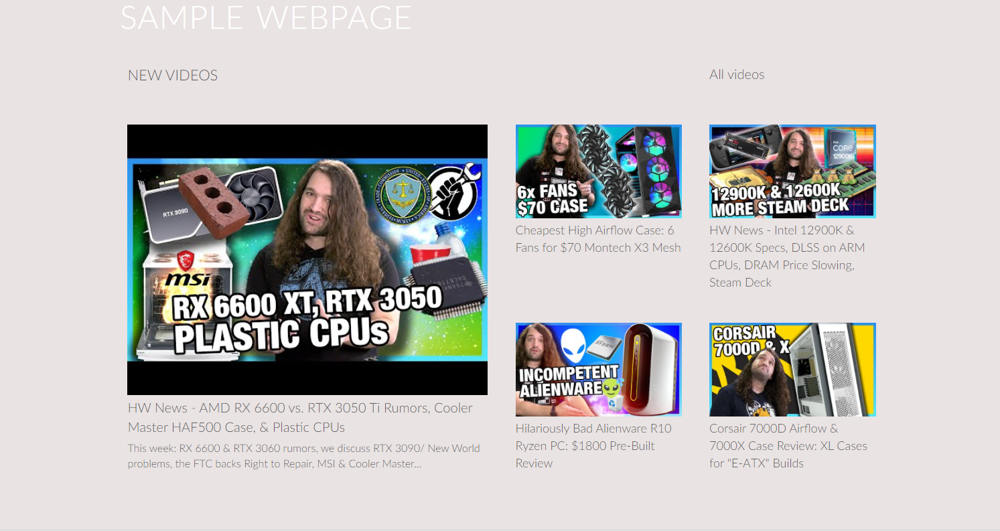

# Youtube API

## Technologies:
* Javascript, HTML, CSS

## Task Objective:
Dynamically pull through the latest videos from a chosen Youtube channel into a prexisting HTML page. 

## Usage
1. Create the [YouTube Data API Key](https://developers.google.com/youtube/registering_an_application).
2. Replace the "PUT YOUR API KEY HERE" with your Key.
```
const apiKey = "PUT YOUR API KEY HERE";
```
3. Optionally replace the *playlistId* with the Id of channel of your choice
```
const playlistId = "UUhIs72whgZI9w6d6FhwGGHA";
```

## Example
